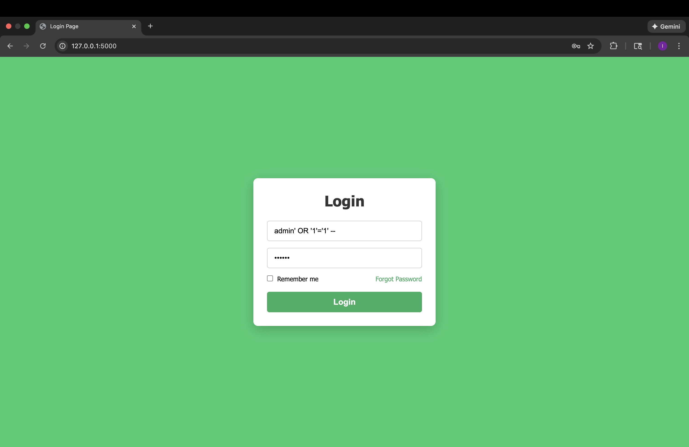
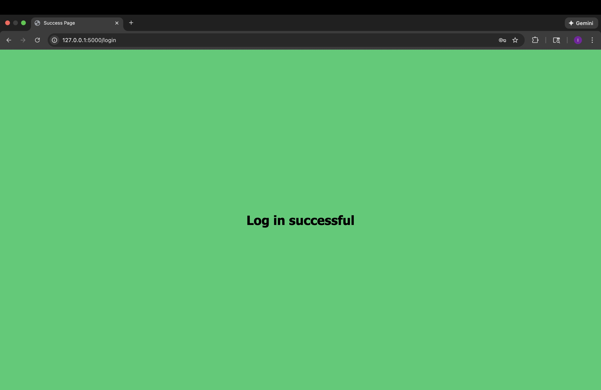

#   Title 

# SQL injection Example 1 - Tautology  Authentication Bypass

##  Introduction 
This attack demonstrates how an attacker can bypass authentication by injecting a tautology (always-true condition) and a into a poorly constructed SQL query

## Code Vulnerability
query=f"SELECT * FROM users WHERE username='{username}' AND password='{password}'"

## Injection Payload 
Attacker enters this exact payload into the *username* field:

admin' OR '1'='1' --

Password field: whatever

## Resulting SQL Query
SELECT * FROM users WHERE username='admin' OR '1'='1' --' AND password='whatever';

# Why this payload works

- the payload's quote (') prematurely closes the username string, which allows the attacker to inject additional SQL code.
- The tautology (OR '1'='1') always evaluates to true which allows the query to bypass authentication.
- the EOL comment ("--") nullifies password verification entirely by commenting out the rest of SQL query

## Screenshot 

## Fix demonstration 

    query="SELECT * FROM users WHERE username=? AND password=?"
    c.execute(query, (username, password))

## Why This Fix Works 

Parameterization works by separating the SQL query structure from the user's input. The database first receives and compiles the SQL query structure with placeholders(?). After processing, user input is then sent separately as parameter data. The database treats the parameter data as string literals rather than executable code, preventing Tautology SQL injection attacks from bypassing authentication.

