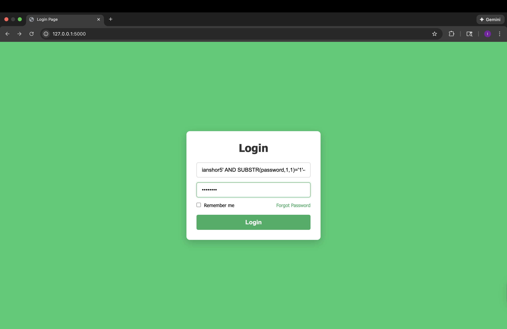
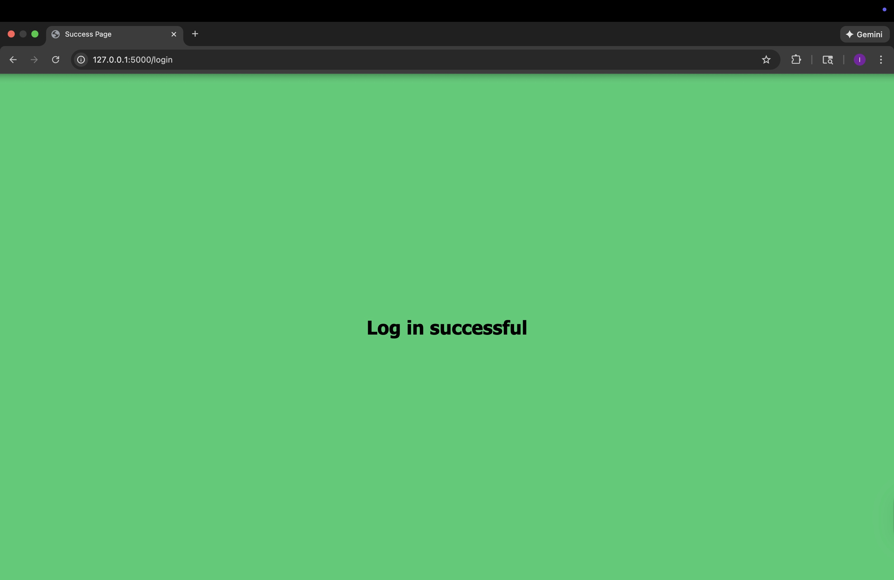
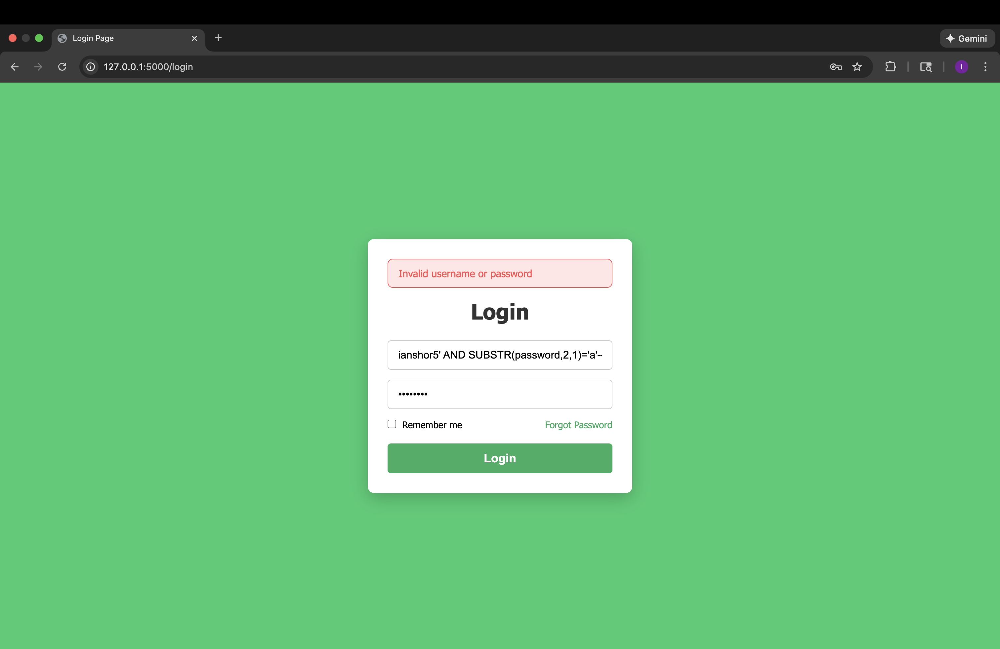

#   Title 

# SQL injection Example 2 - Boolean-Based SQL injection

##  Introduction 
This atack demonstrates how attackers can use Boolean-based SQL injection to recover credentials without seeing the database output 

## Code Vulnerability
query=f"SELECT * FROM users WHERE username='{username}' AND password='{password}'"

## Injection Payload 
Attacker enters this exact payload (with victim's username) into the *username* field:

ianshor5' AND SUBSTR(password,1,1)='1'--

Password field: whatever

## Resulting SQL Query
SELECT * FROM users WHERE username='ianshor5' AND SUBSTR(password,1,1)='1'-- AND password='whatever'

# Why this payload works

- This works because the application lacks input validation, allowing user input to be directly concatenated into the SQL query

- The attacker injects " ianshor5'" (or any victim's username), which closes the string literal and everything that follows is interpreted as raw SQL code from the perspective of the database parser (AND SUBSTR(password,1,1)='1'--)

- The injected condition (AND SUBSTR(password,1,1)='1'--) allows the attacker to verify whether the user's password begin with the character "1" or not

- The " -- " injection effectively comments out the remaining portion of the SQL query

- Because the backend allows authentication to be verified if any row is returned, the attacker can directly exploit it's boolean behavior  
    - A successful login verifies the tested character and is at the tested position 
    - A failed login reveals that the tested character does not appear at the position

- Through probing the database character-by-character, the attacker can reveal legitimate credentials without receving legitimate database output 

## NOTE: Real-World Context 

In my demo, A true injected condition allows for full login. In most real applications, full user access isn't granted via a blind SQL injection. Instead, attackers look small behavioral differences, such as unconventional error messages or slower response times.

## Screenshots

## Fix demonstration 

query="SELECT * FROM users WHERE username=? AND password=?"
    c.execute(query, (username, password))

## Why This Fix Works 

Parameterization works by separating the SQL query structure from the user's input. The database first receives and compiles the SQL query structure with placeholders(?). After processing, user input is then sent separately as parameter data. The database treats the parameter data as string literals rather than executable code, preventing Blind SQL injection attacks from bypassing authentication.

